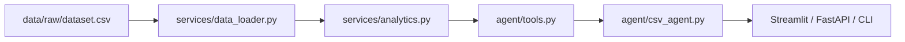
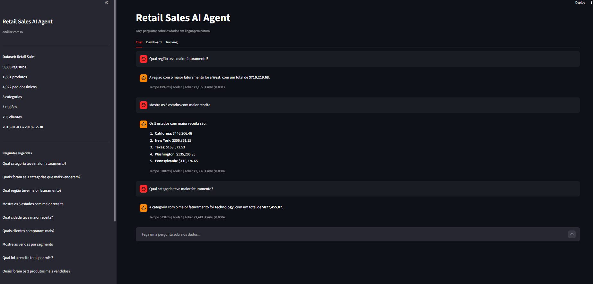
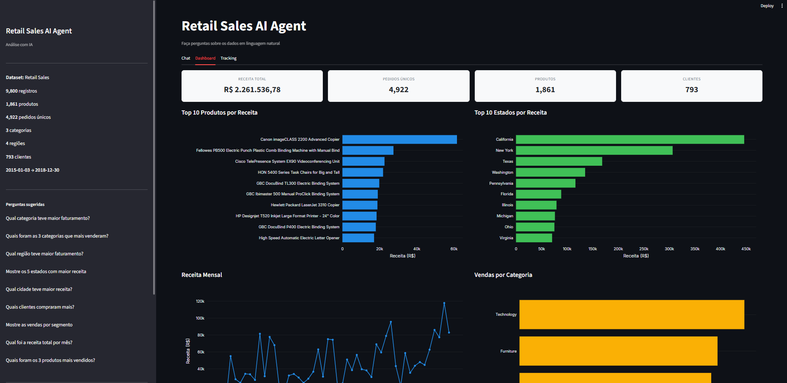
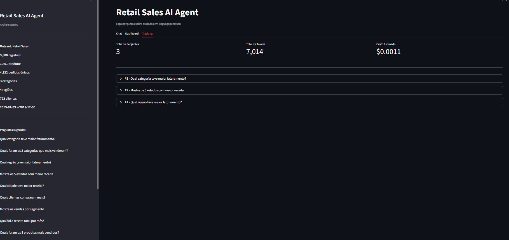

# Retail Sales AI Agent

Agente de IA para exploração de dados de varejo em linguagem natural. O projeto combina **Streamlit**, **FastAPI**, **LangChain**, **LangGraph** e **OpenAI** para responder perguntas sobre o dataset retail, além de oferecer dashboard, rastreabilidade de chamadas e API para integração.

## Visão Geral

O objetivo do projeto é transformar um CSV de vendas em uma experiência interativa de análise. Você pode conversar com o agente, abrir o dashboard ou integrar via API.

O fluxo principal é:



### O que o projeto entrega

- Respostas em linguagem natural sobre o dataset retail.
- Métricas prontas para produto, região, estado, cidade, cliente, categoria e segmento.
- Interface web com chat, dashboard e observabilidade.
- API REST para consumo por outras aplicações.
- Testes automatizados para garantir a consistência do pipeline.

## Capturas da Interface

### Chat

A aba Chat mostra a conversa com o agente, o resumo da pergunta e o trace da execução.



### Dashboard

A aba Dashboard apresenta métricas executivas e gráficos com os principais recortes do dataset.



### Tracking

A aba Tracking exibe o histórico de perguntas, tempo de resposta, tokens e custo estimado.



## Estrutura do Projeto

```text
ETL-AI ANALYTICS/
├── main.py                  # Entrada principal: CLI, API ou Streamlit
├── config/
│   └── settings.py          # Configuração central via .env
├── models/
│   └── schemas.py           # Schemas da API e modelos auxiliares
├── services/
│   ├── data_loader.py       # Leitura e normalização do CSV retail
│   └── analytics.py         # Consultas analíticas em pandas
├── agent/
│   ├── csv_agent.py         # Facade do agente LangGraph/LangChain
│   ├── tools.py             # Ferramentas expostas ao LLM
│   └── prompts.py           # Prompt do sistema
├── api/
│   ├── app.py               # Aplicação FastAPI
│   └── routes.py            # Endpoints REST
├── observability/
│   └── tracker.py           # Trace, tokens e custo estimado
├── ui/
│   └── streamlit_app.py     # Interface web principal
├── data/
│   └── raw/
│       └── dataset.csv      # Dataset retail do projeto
├── docs/
│   └── images/              # Capturas da interface
├── tests/                   # Testes automatizados
├── Dockerfile
├── docker-compose.yml
└── .env.example
```

## Dataset

O projeto foi preparado para trabalhar exclusivamente com o dataset retail em `data/raw/dataset.csv`.

### Campos principais do CSV

- `row_id`: identificador da linha.
- `order_id`: identificador do pedido.
- `order_date`: data do pedido.
- `ship_date`: data de envio.
- `ship_mode`: modalidade de envio.
- `customer_id`: identificador do cliente.
- `customer_name`: nome do cliente.
- `segment`: segmento do cliente.
- `country`: país.
- `city`: cidade.
- `state`: estado.
- `postal_code`: CEP.
- `region`: região geográfica.
- `product_id`: identificador do produto.
- `category`: categoria.
- `sub_category`: subcategoria.
- `product_name`: nome do produto.
- `sales`: valor de venda da linha.

### O que o loader faz

O arquivo é lido, normalizado e enriquecido com colunas auxiliares como:

- `date`
- `actual_quantity`
- `actual_revenue`
- `year`
- `month`
- `month_name`
- `quarter`
- `local` como alias estável para `region`

## Como o Projeto Funciona

1. O CSV é carregado por `services/data_loader.py`.
2. O `DataFrame` é enriquecido com colunas derivadas.
3. `services/analytics.py` oferece consultas prontas para os principais cenários.
4. `agent/tools.py` converte essas consultas em ferramentas para o LLM.
5. `agent/csv_agent.py` monta o agente e mantém memória de conversa.
6. A aplicação é exposta pela CLI, pela API ou pela interface Streamlit.

## Principais Capacidades

### Perguntas que fazem sentido neste projeto

- Qual categoria teve maior faturamento?
- Quais foram as 3 categorias que mais venderam?
- Qual região teve maior faturamento?
- Mostre os 5 estados com maior receita.
- Qual cidade teve maior receita?
- Quais clientes compraram mais?
- Mostre as vendas por segmento.
- Qual foi a receita total por mês?
- Quais foram os 3 produtos mais vendidos?

### O que não existe neste dataset

O dataset retail não possui colunas de:

- quantidade planejada
- preço planejado
- promoções
- nível de serviço

Por isso, perguntas sobre planejado vs realizado, promoções e service level são tratadas como indisponíveis.

## Ferramentas do Agente

O agente expõe 13 ferramentas principais:

| Ferramenta | O que faz |
|-----------|-----------|
| `dataset_overview` | Resumo geral do dataset |
| `top_products_by_quantity` | Produtos mais vendidos por unidades |
| `top_locations_by_quantity` | Regiões mais fortes em unidades |
| `top_products_by_revenue` | Produtos com maior faturamento |
| `top_locations_by_revenue` | Regiões com maior faturamento |
| `total_sales_in_period` | Vendas em um intervalo de datas |
| `monthly_sales_summary` | Evolução mensal das vendas |
| `top_categories_by_sales` | Categorias com maior receita |
| `top_states_by_sales` | Estados com maior receita |
| `top_cities_by_sales` | Cidades com maior receita |
| `top_customers_by_sales` | Clientes com maior receita |
| `sales_by_segment` | Receita por segmento |
| `python_repl` | Análise livre com pandas quando necessário |

## Requisitos

- Python 3.11 ou superior
- Chave válida da OpenAI

## Configuração Local

### 1. Entrar no projeto

```powershell
Set-Location "C:\Users\Davi\Documents\ETL-AI ANALYTICS"
```

### 2. Criar a virtualenv

```powershell
py -3.12 -m venv .venv
```

### 3. Ativar a virtualenv

```powershell
Set-ExecutionPolicy -Scope Process -ExecutionPolicy Bypass
.\.venv\Scripts\Activate.ps1
```

### 4. Instalar dependências

```powershell
pip install -r requirements.txt
```

### 5. Configurar o `.env`

```powershell
Copy-Item .env.example .env
notepad .env
```

Edite o arquivo e preencha a sua chave:

```env
OPENAI_API_KEY=sk-...
```

O caminho padrão do CSV já aponta para o dataset retail interno:

```env
CSV_PATH=data/raw/dataset.csv
CSV_SEPARATOR=,
```

## Como Rodar

### CLI

```powershell
python main.py
```

### API

```powershell
python main.py --api
```

Documentação Swagger:

- `http://localhost:8000/docs`

### Streamlit

```powershell
python main.py --streamlit
```

Interface web:

- `http://localhost:8501`

## Docker

O Docker serve para empacotar a aplicação com as mesmas dependências e o mesmo comportamento em qualquer máquina.

### Docker Compose

```powershell
docker compose up api streamlit
```

### CLI via Docker

```powershell
docker compose run --rm cli
```

### Build manual

```powershell
docker build -t retail-sales-ai-agent .
```

## API

### Endpoints disponíveis

| Método | Endpoint | Descrição |
|--------|----------|-----------|
| `POST` | `/api/v1/chat` | Envia uma pergunta ao agente |
| `GET` | `/api/v1/analytics/overview` | Visão geral do dataset |
| `GET` | `/api/v1/analytics/top-products?by=quantity` | Top produtos por unidades |
| `GET` | `/api/v1/analytics/top-products?by=revenue` | Top produtos por faturamento |
| `GET` | `/api/v1/analytics/top-locations?by=quantity` | Top regiões por unidades |
| `GET` | `/api/v1/analytics/top-locations?by=revenue` | Top regiões por faturamento |
| `GET` | `/api/v1/analytics/promotions` | Retorna indisponível para retail |
| `GET` | `/api/v1/analytics/planned-vs-actual` | Retorna indisponível para retail |
| `GET` | `/api/v1/analytics/service-level` | Retorna indisponível para retail |
| `GET` | `/health` | Health check |

### Exemplo de chamada

```bash
curl -X POST http://localhost:8000/api/v1/chat \
  -H "Content-Type: application/json" \
  -d '{"question": "Qual região teve maior faturamento?"}'
```

## Observabilidade

Cada pergunta gera um trace com:

- tempo total de execução
- número de tokens
- custo estimado
- ferramentas utilizadas
- modelo chamado

Na interface Streamlit isso aparece na aba Tracking. No CLI, aparece abaixo de cada resposta.

## Testes

### Rodar a suíte

```powershell
pytest
```

### Rodar integrações com LLM

```powershell
pytest -m integration
```

### O que os testes cobrem

- carregamento e limpeza do CSV
- ranking de produtos, regiões, estados, cidades, clientes e segmentos
- endpoints da API
- formato das tools do agente
- comportamento de métricas indisponíveis no dataset retail

## Notas Importantes

- O projeto foi deixado intencionalmente focado apenas no dataset retail.
- O arquivo `.env` não deve ser versionado.
- O CSV retail já está salvo no repositório em `data/raw/dataset.csv`.
- As capturas da interface ficam em `docs/images/`.

## Próximos Passos Sugeridos

- Melhorar os gráficos do dashboard com filtros adicionais.
- Adicionar exportação de respostas e métricas.
- Criar mais endpoints analíticos específicos para retail.
- Incluir relatórios automáticos por período.
